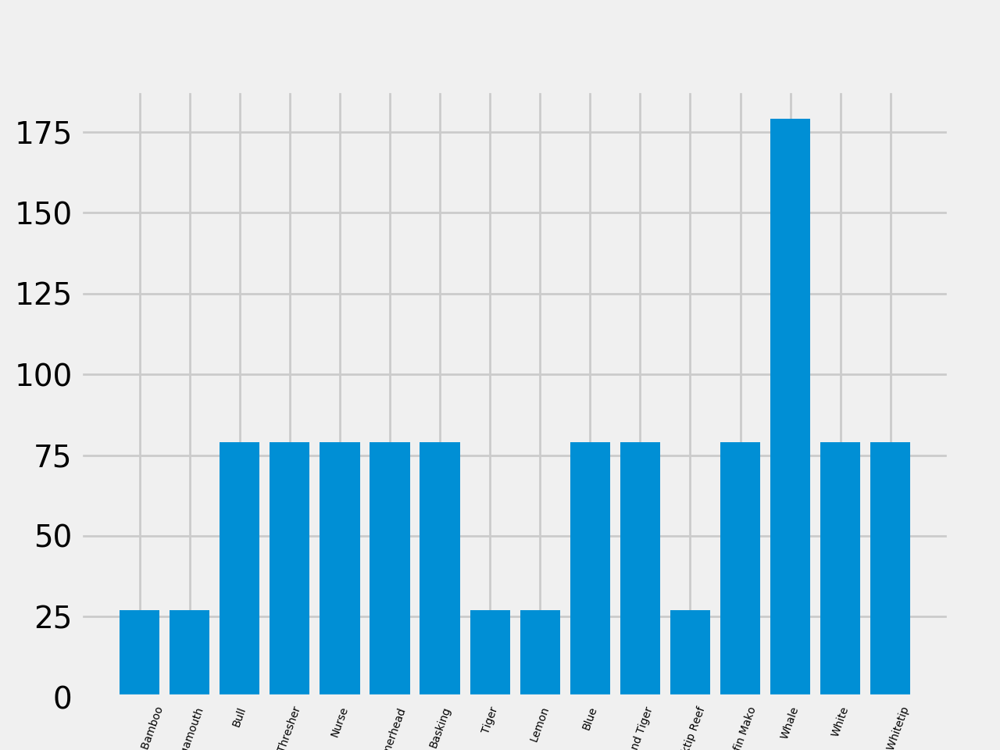

# Megalodon
Megalodon is an extensive library of all-that-is-to-sharks. It contains various shark datasets, a model zoo and pre-trained networks for various tasks.

# Shark Species Analysis
The dataset is highly imbalanced due to some lesser known species of sharks. It is dependent on the images available on Google. For the sake of sample, some images are available in the repository. All the images are not published and will not be published. However, the numpy files and the code would be available for use-cases.
The frequency distribution of different species is shown in the graph.

# Finegrained Images

<table style="width:100%">
  <tr>
    <th>Specie Name</th>
    <th>Image</th> 
  </tr>
  <tr>
    <td>Nurse Shark</td>
    <td></td>
  </tr>
  <tr>
    <td>White Shark</td>
    <td></td>
  </tr>
  <tr>
    <td>Tiger Shark</td>
    <td></td>
  </tr>
</table>

</body>
</html>

# Shark Calls
